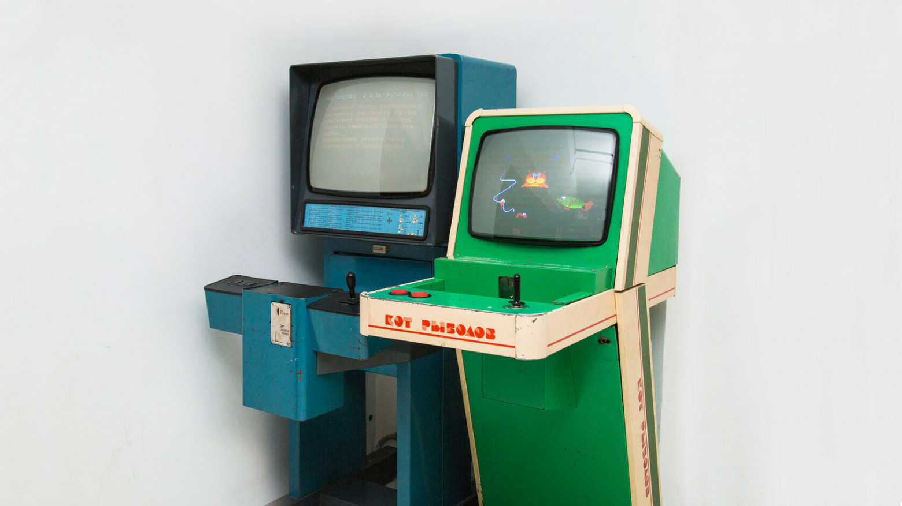
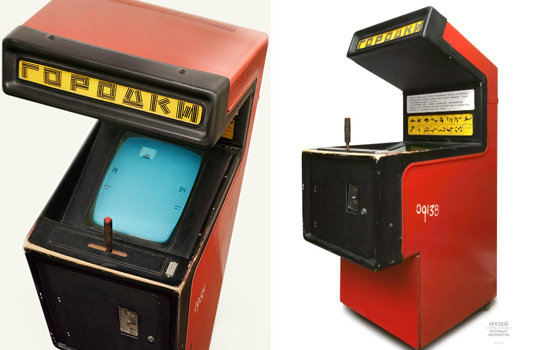

# TIA-MC-1 - USSR Arcade emulator

The TIA-MC-1 (Russian: ТИА-МЦ-1) — Телевизионный Игровой Автомат Многокадровый Цветной 
(pronounced Televizionniy Igrovoi Automat Mnogokadrovyi Tcvetnoi; meaning Video Game Machine – Multiframe Colour) 
was a Soviet arcade machine with replaceable game programs and was one of the most famous arcade machines from the Soviet Union. 

The TIA-MC-1 was developed in Vinnytsia, Ukraine by the Ekstrema-Ukraina company in the mid-1980s under the leadership of V.B. Gerasimov. The machine was manufactured by the production association Terminal and some other factories.

### Some of the TIA-MC-1 based games are:

#### included
- Снежная королева (Snezhnaja koroleva, The Snow Queen by Hans Christian Andersen)
- Конёк-Горбунок (Konek-Gorbunok, The Humpbacked Horse by Pyotr Pavlovich Yershov)
- Кот-рыболов (Kot-Rybolov, Cat the fisher)
- Биллиард (Billiard, a pool-like game)
- S.O.S.

#### lost
- Звёздный рыцарь (Zvezdnyi Rytsar, Star Knight)
- Истребитель (Istrebiteli, Fighter Jet, Harrier)
- Котигорошко (Kotigoroshko, title of a Ukrainian fairy tale)
- Остров дракона (Ostrov Drakona, Dragon Island)
- Остров сокровищ (Ostrov Sokrovish, Treasure Island by Robert Louis Stevenson)
- Автогонки (Avtogonki, Autoracing)

